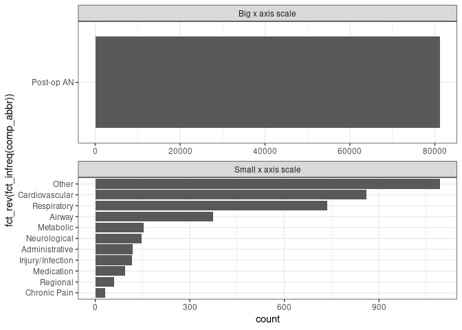

MOVER dataset: EPIC complications
================

``` r
library(tidyverse)
theme_set(theme_bw())
source("01_read_clean.R")
```

The post-operative complications dataset includes 36985 patients who had
64214 surgeries.

The whole dataset includes 39685 patients who had 64354 surgeries, a
discrepancy of 140 surgeries. Which is small considering the overall
size. I wonder if these patients could have died without a recorded
complication?

# Number of surgeries that resulted in any complication

``` r
complications %>% 
  count(any_complication, name = "n_patients") %>% 
  knitr::kable()
```

| any_complication | n_patients |
|:-----------------|-----------:|
| No               |      61387 |
| Yes              |       2829 |

# Number of complications per surgery

``` r
complications %>% 
  count(n_complications, name = "n_patients") %>% 
  knitr::kable()
```

| n_complications | n_patients |
|----------------:|-----------:|
|               0 |      61387 |
|               1 |        350 |
|               2 |       1681 |
|               3 |        340 |
|               4 |        182 |
|               5 |        117 |
|               6 |         72 |
|               7 |         60 |
|               8 |          6 |
|               9 |          2 |
|              10 |         12 |
|              11 |          1 |
|              12 |          2 |
|              13 |          3 |
|              17 |          1 |

# Types of complications

``` r
complications_all %>% 
  filter(comp_abbr != "None") %>% 
  #filter(comp_abbr != "Post-op AN") %>% 
  ggplot(aes(y = fct_rev(fct_infreq(comp_abbr)))) +
  geom_bar() +
  facet_wrap(~if_else(comp_abbr == "Post-op AN", "Big x axis scale", "Small x axis scale"),
             scales = "free", ncol = 1)
```



By far the most common complication is “AN Post-op Complications”, which
I’ve shortened to “Post-op AN” for plotting/brevity purposes. It seems
to cover everything from “None” to “Death”:

``` r
complications_all %>% 
  filter(comp_abbr == "Post-op AN") %>% 
  count(comp_abbr, complication, sort = TRUE) %>%
  slice(1:20) %>% 
  knitr::kable()
```

| comp_abbr  | complication     |     n |
|:-----------|:-----------------|------:|
| Post-op AN | None             | 77776 |
| Post-op AN | Other            |   872 |
| Post-op AN | Cardiovascular   |   615 |
| Post-op AN | Respiratory      |   585 |
| Post-op AN | Airway           |   341 |
| Post-op AN | Unknown          |   200 |
| Post-op AN | Neurological     |   134 |
| Post-op AN | Metabolic        |   131 |
| Post-op AN | Administrative   |   130 |
| Post-op AN | Injury/Infection |   125 |
| Post-op AN | Medication       |    94 |
| Post-op AN | Death            |    76 |
| Post-op AN | Regional         |    55 |
| Post-op AN | Chronic Pain     |    32 |
